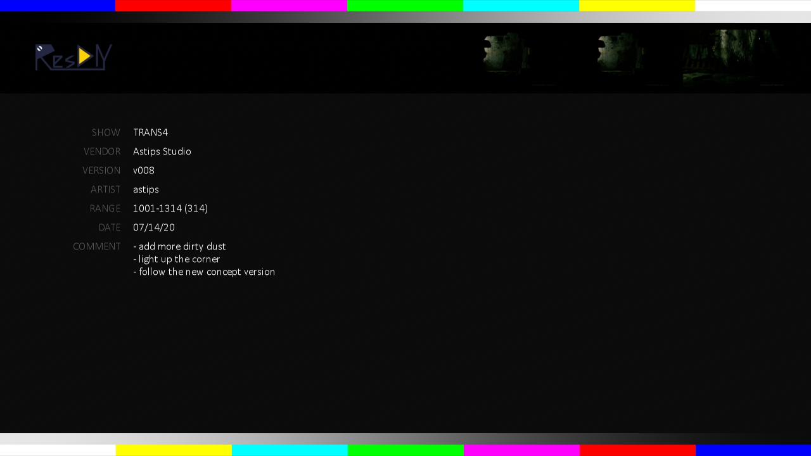
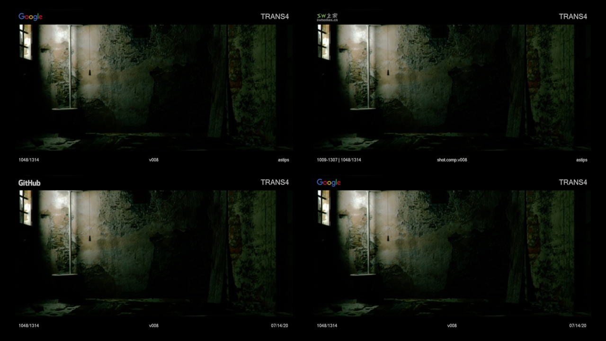
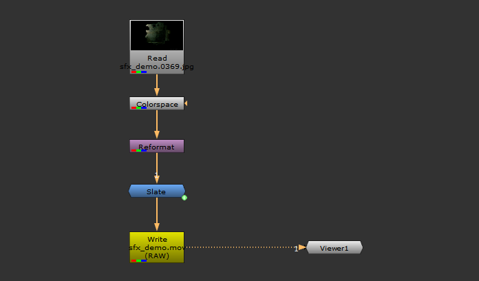
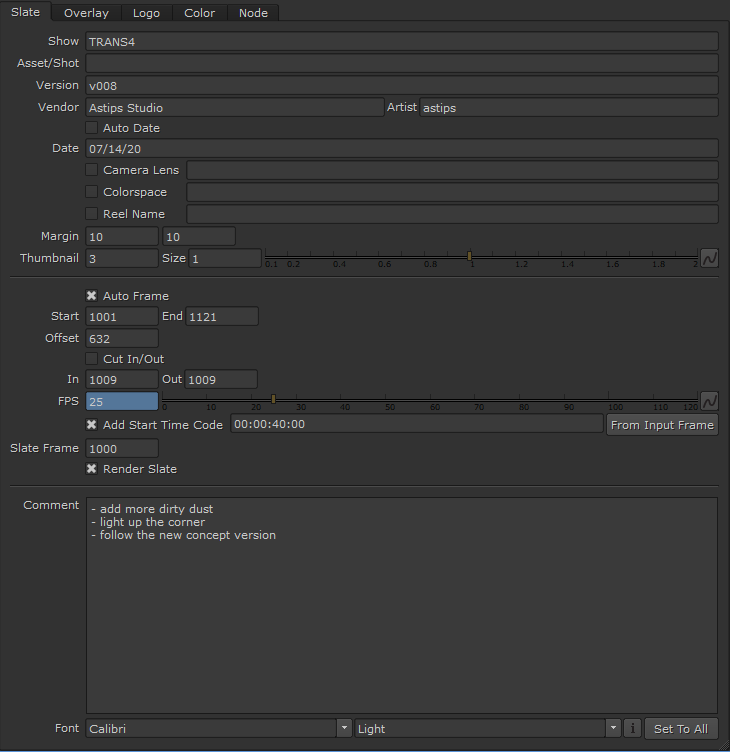
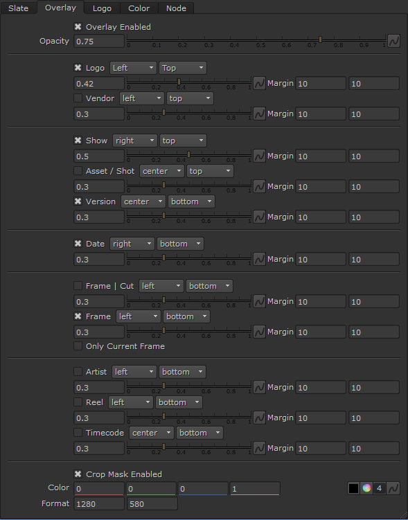

# nuke-gizmo-magic-slate
Slate &amp; Overlay Burn-in (watermark)

### Slate Frame

### Contact Sheet

### Scene Node Graph

### Slate Knob Overview

### Overlay Knob Overview

### INSTALLATION
1. Download the latest release and unzip the folder where you want to live.
2. Copy plugin file  "_MagicSlate.gizmo_" into your **_NUKE_PATH_** dir

### RELEASE
[RELEASE INFO](RELEASE.md)

### HAVING ISSUES?
Please send an email with the error message and a detailed step by step process of how you got the error.
Comments, suggestions and bug reports are welcome.  
